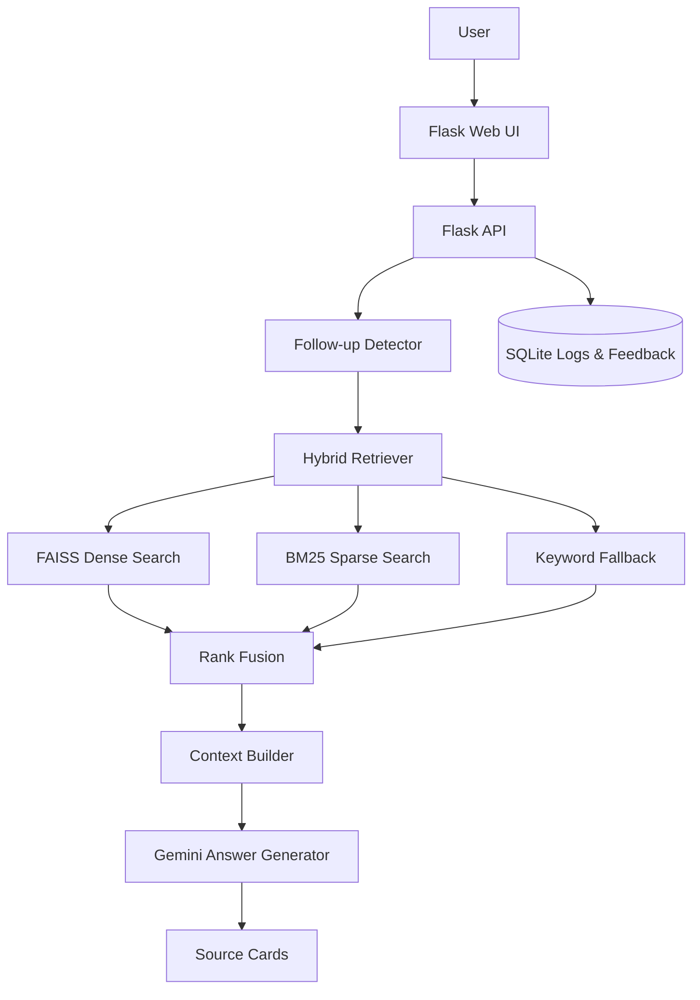

# Vietnamese eGov RAG Assistant

Vietnamese eGov RAG Assistant is a Flask-based retrieval-augmented chatbot for Vietnamese administrative procedures. It uses the existing public-service dataset, hybrid retrieval, source-grounded generation, a web demo, Docker packaging, SQLite logging, and evaluation scripts.

## Demo

Run locally and open:

```text
http://localhost:7860
```

The public demo URL can be added here after deployment.

## Features

- Hybrid retrieval over Vietnamese procedure data with FAISS, BM25, and fallback keyword search.
- Source-grounded answers with source cards returned by `/chat`.
- Multi-turn context for follow-up questions.
- Server-side `/search`, `/feedback`, `/stats/popular`, and `/stats/feedback`.
- SQLite query logs, feedback, and popular-procedure counters.
- Docker and Docker Compose support.
- Evaluation scripts for retrieval, source matching, generation checks, and latency.

## Architecture



## Dataset

The default data source is the Hugging Face dataset:

```text
HungBB/egov-bot-data
```

Expected files:

```text
index.faiss
metas.pkl.gz
bm25.pkl.gz
toan_bo_du_lieu_final.json
```

The bundled frontend no longer downloads the 73MB JSON file in the browser. Search is handled by the backend.

## Local Setup

```bash
python -m venv .venv

# Windows
.venv\Scripts\activate

# macOS/Linux
source .venv/bin/activate

pip install -r requirements.txt
cp .env.example .env
# edit .env and set GOOGLE_API_KEY
python scripts/run_dev.py
```

If `GOOGLE_API_KEY` is missing, the app still starts and returns a source extract fallback instead of Gemini-generated prose.

### Data and Cache Behavior

The app does not load the 73MB JSON in the browser anymore. The backend loads
procedure data, retrieval indexes, and the embedding model when the Flask process
starts.

With `DATA_SOURCE=hf`, startup calls Hugging Face's cache API for the expected
resource files. If a file is already cached, it is reused; if it is missing, the
app tries to download only that missing file. This means later startups may still
show resource-loading logs, but they should not re-download files that are
already present in `.cache`.

To prefetch resources once:

```bash
python scripts/download_resources.py
```

To force cache-only startup after resources are present:

```env
HF_LOCAL_FILES_ONLY=true
```

For a fully local index, build the files into `.cache/egov_data` and switch to
`DATA_SOURCE=local`:

```bash
python scripts/build_local_index.py --input static/data/toan_bo_du_lieu_final.json --output-dir .cache/egov_data
```

## Docker

Docker is optional for development, but the project includes Docker packaging so
the app can be run consistently on another machine or deployment platform.

```bash
cp .env.example .env
# edit .env and set GOOGLE_API_KEY
docker build -t egov-bot .
docker run --env-file .env -p 7860:7860 egov-bot
```

Or:

```bash
docker compose up --build
```

The Compose setup mounts these host directories into the container:

```text
./.cache    -> /app/.cache      # Hugging Face/index/model cache
./user_data -> /app/user_data   # SQLite logs, feedback, counters
```

So the first run may download/cache resources, while later runs reuse them.

## API Reference

### `GET /health`

Returns app status, resource-loading status, model availability, and version.

### `POST /chat`

Request:

```json
{
  "question": "Đăng ký khai sinh cần giấy tờ gì?",
  "session_id": "user-123"
}
```

Response:

```json
{
  "answer": "...",
  "sources": [
    {
      "title": "Thủ tục đăng ký khai sinh",
      "url": "https://...",
      "agency": "...",
      "score": 0.95,
      "snippet": "..."
    }
  ],
  "request_id": "...",
  "latency_ms": 1234,
  "cached": false,
  "context_source": "https://..."
}
```

### `GET /search?q=&limit=`

Returns procedure search results.

### `POST /feedback`

Stores `like`, `dislike`, or `neutral` feedback in SQLite.

### `POST /clear_session`

Clears in-memory conversation context for the provided `session_id`.

## Evaluation

Build a testset:

```bash
python evaluation/build_testset.py
```

Run all available checks:

```bash
python evaluation/run_all.py
```

Reports are written to:

```text
evaluation/reports/latest_metrics.json
evaluation/reports/latest_report.md
```

API-based generation and latency checks require the local server to be running.

## Local Index Rebuild

The default mode uses the hosted index. To rebuild a local index:

```bash
python scripts/build_local_index.py --input static/data/toan_bo_du_lieu_final.json --output-dir .cache/egov_data
```

Then set:

```env
DATA_SOURCE=local
DATA_DIR=.cache/egov_data
```

## Limitations

- Data may not reflect real-time changes from official portals.
- The assistant is not a substitute for official legal or administrative guidance.
- First startup can be slow because models and index files may need to download.
- Free deployment platforms may cold-start or run out of memory when loading embedding models.

## CV Summary

Built a Dockerized Vietnamese e-government RAG chatbot with hybrid BM25 + FAISS retrieval, source-grounded Gemini generation, multi-turn follow-up handling, SQLite feedback/logging, a web demo, and automated evaluation across retrieval, source matching, OOD handling, and latency.
