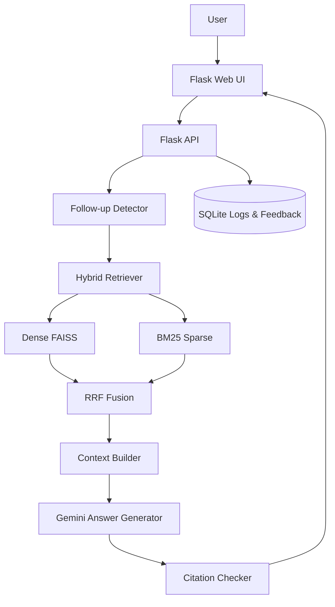

# Kế hoạch chỉnh sửa chi tiết eGov-Bot Local + Web Demo

> Repo gốc: `https://github.com/leminhkhai345/eGov-Bot-LocalVersion`  
> Mục tiêu: biến project hiện tại từ demo chạy được thành một project RAG chuyên nghiệp, có thể chạy local, chạy Docker, demo web public, có benchmark/evaluation và README đủ mạnh để đưa vào CV xin thực tập AI/RAG.

---

## 0. Định hướng tổng thể

### 0.1. Không làm lại từ số 0

Không nên xoá repo và viết lại hoàn toàn. Repo hiện tại đã có nhiều phần có giá trị:

- Domain tốt: hỏi đáp thủ tục hành chính Việt Nam.
- Có dữ liệu thật từ Cổng dịch vụ công.
- Có web UI.
- Có backend Flask.
- Có RAG dùng embedding + FAISS + BM25.
- Có Dockerfile.
- Có script evaluation ban đầu.
- Có dữ liệu/index được host trên Hugging Face Dataset.

Cách làm đúng là **refactor có kiểm soát**:

1. Giữ lại hành vi chạy được hiện tại.
2. Tạo nhánh mới.
3. Sửa lỗi blocking trước: Docker, requirements, env, health check.
4. Tách dần `app.py` thành module.
5. Cải thiện retrieval.
6. Thêm benchmark.
7. Nâng cấp UI và deploy.
8. Viết lại README theo chuẩn project AI production-style.

### 0.2. Nguyên tắc không được vi phạm

- Không commit API key.
- Không hard-code đường dẫn local như `D:\...` hoặc `/content/drive/...` trong code chính.
- Không để Docker build phụ thuộc vào file không tồn tại.
- Không để toàn bộ logic trong một file `app.py` lớn.
- Không quảng cáo “no hallucination” nếu chưa có citation/evaluation chứng minh.
- Không thay đổi dữ liệu/index trước khi có test baseline.
- Mỗi bước lớn phải có tiêu chí pass/fail.
- Mỗi lần refactor phải chạy lại smoke test.
- Không sửa frontend và backend cùng lúc nếu chưa có test API.

---

## 1. Hiện trạng repo cần ghi nhớ

### 1.1. Cấu trúc hiện tại

Repo hiện có các phần chính:

```text
.eGov-Bot-LocalVersion/
├── .vscode/
├── Offline_Pharse/
├── static/
├── templates/
├── user_data/
├── Dockerfile
├── LICENSE
├── README.md
├── app.py
└── requirements.txt
```

Trong README hiện tại, project được mô tả là hệ thống hỏi đáp thủ tục hành chính Việt Nam, có tính năng tra cứu thủ tục, hội thoại nhiều lượt, nút New Chat và web interface.

### 1.2. Dữ liệu hiện tại

Dataset đang được host trên Hugging Face:

```text
HungBB/egov-bot-data
```

Các file được README mô tả:

```text
index.faiss                 # FAISS vector index
metas.pkl.gz                # metadata chunks
bm25.pkl.gz                 # BM25 index
id_to_record.pkl            # lookup parent record
toan_bo_du_lieu_final.json # full dataset, chú ý kiểm tra tên file thật
```

Trong `app.py` hiện tại, code tải các file sau từ Hugging Face:

```python
index.faiss
metas.pkl.gz
bm25.pkl.gz
toan_bo_du_lieu_final.json
```

Vì vậy, khi sửa phải thống nhất tên file là:

```text
toan_bo_du_lieu_final.json
```

### 1.3. Model hiện tại

Theo code hiện tại:

```python
EMB_MODEL = "AITeamVN/Vietnamese_Embedding"
GENAI_MODEL = "gemini-2.5-flash"
HF_REPO_ID = "HungBB/egov-bot-data"
```

Nên giữ các giá trị này ở bước đầu để tránh làm thay đổi hành vi hệ thống.

### 1.4. Backend hiện tại

Backend đang nằm chủ yếu trong `app.py`, gồm:

- Load FAISS.
- Load metadata.
- Load BM25.
- Load raw JSON.
- Load embedding model.
- Init Gemini model.
- Cache answer.
- Cache embedding.
- Retrieval.
- Context manager.
- Prompt builder.
- Flask routes:
  - `/`
  - `/health`
  - `/chat`
  - `/clear_session`
  - `/save_feedback`
  - `/update_popular`
  - route phục vụ `user_data`.

Vấn đề: quá nhiều trách nhiệm trong một file, khó test và khó mở rộng.

### 1.5. Docker hiện tại

Dockerfile hiện tại đang có vấn đề nghiêm trọng:

```dockerfile
FROM python:3.9
WORKDIR /app
COPY requirements.txt .
RUN apt-get update && apt-get install -y $(cat packages.txt)
RUN pip install --no-cache-dir -r requirements.txt
COPY . .
CMD ["python", "app.py"]
```

Vấn đề:

- Có tham chiếu `packages.txt` nhưng root repo hiện không thấy file này.
- Chưa expose port.
- Chưa dùng `gunicorn` dù requirements có ghi gunicorn.
- Chưa tối ưu cache layer.
- Chưa có `.dockerignore`.
- Chưa có `docker-compose.yml`.
- Chưa có healthcheck.

### 1.6. Evaluation hiện tại

`Offline_Pharse/Model_Evaluation.py` hiện có ý tưởng tốt nhưng chưa chuyên nghiệp:

- Có tạo testset 100 mẫu.
- Có gọi API local `/chat`.
- Có dùng BERTScore.
- Có kiểm tra link match.

Vấn đề:

- Dùng đường dẫn Colab `/content/drive/...`.
- Dùng đường dẫn Windows `D:\...`.
- Testset random nhưng chưa quản lý seed rõ ràng.
- Chưa đánh giá retrieval riêng.
- Chưa có Recall@k, MRR, nDCG.
- Chưa có báo cáo markdown/csv tự động.
- Chưa có test OOD.
- Chưa có latency p50/p95.

---

## 2. Mục tiêu bản làm lại

### 2.1. Mục tiêu bắt buộc

Sau khi hoàn thành, repo phải có:

1. Chạy local bằng Python.
2. Chạy local bằng Docker.
3. Có web UI hoạt động.
4. Có API `/chat`, `/health`, `/search`, `/feedback`.
5. Có RAG pipeline rõ ràng.
6. Có source/citation trong câu trả lời.
7. Có benchmark retrieval.
8. Có benchmark answer/citation.
9. Có benchmark latency.
10. Có README chuyên nghiệp.
11. Có `.env.example`.
12. Có Makefile hoặc script chạy chuẩn.
13. Có Dockerfile không lỗi.
14. Có demo public trên web.

### 2.2. Mục tiêu phụ nhưng nên làm

- Có SQLite để lưu session, feedback và query logs.
- Có pytest cơ bản.
- Có GitHub Actions chạy lint/test.
- Có architecture diagram.
- Có demo GIF hoặc screenshot trong README.
- Có `docs/` chứa evaluation report.
- Có endpoint debug retrieval chỉ bật ở local.

### 2.3. Tên project mới đề xuất

Dùng tên chuyên nghiệp hơn:

```text
Vietnamese eGov RAG Assistant
```

Tên repo mới có thể là:

```text
vietnamese-egov-rag-assistant
```

Hoặc giữ repo cũ nhưng đổi README title.

---

## 3. Chiến lược branch và backup

### 3.1. Tạo branch mới

```bash
git clone https://github.com/leminhkhai345/eGov-Bot-LocalVersion.git
cd eGov-Bot-LocalVersion
git checkout -b refactor-production-rag
```

### 3.2. Tạo tag baseline

```bash
git tag baseline-before-refactor
git status
```

### 3.3. Không sửa trực tiếp `main`

Quy tắc:

- `main`: bản cũ hoặc bản stable.
- `refactor-production-rag`: bản đang làm.
- Mỗi phase commit riêng.

Ví dụ commit:

```bash
git add .
git commit -m "fix docker and environment setup"
git commit -m "refactor config and resource loading"
git commit -m "add retrieval evaluation pipeline"
```

---

## 4. Cấu trúc thư mục mục tiêu

### 4.1. Cấu trúc đề xuất an toàn, vẫn dựa trên Flask hiện tại

```text
eGov-Bot-LocalVersion/
├── README.md
├── LICENSE
├── .gitignore
├── .env.example
├── .dockerignore
├── Dockerfile
├── docker-compose.yml
├── Makefile
├── requirements.txt
├── requirements-dev.txt
├── pyproject.toml
│
├── src/
│   └── egov_bot/
│       ├── __init__.py
│       ├── app.py                 # create_app(), Flask entry
│       ├── config.py              # Settings/env
│       ├── logging_config.py
│       │
│       ├── api/
│       │   ├── __init__.py
│       │   ├── chat_routes.py
│       │   ├── health_routes.py
│       │   ├── search_routes.py
│       │   └── feedback_routes.py
│       │
│       ├── schemas/
│       │   ├── __init__.py
│       │   ├── chat.py
│       │   ├── search.py
│       │   └── feedback.py
│       │
│       ├── data/
│       │   ├── __init__.py
│       │   ├── hf_downloader.py
│       │   ├── resource_loader.py
│       │   └── procedure_store.py
│       │
│       ├── retrieval/
│       │   ├── __init__.py
│       │   ├── dense_retriever.py
│       │   ├── sparse_retriever.py
│       │   ├── hybrid_retriever.py
│       │   ├── reranker.py
│       │   └── normalizer.py
│       │
│       ├── rag/
│       │   ├── __init__.py
│       │   ├── prompt_builder.py
│       │   ├── answer_generator.py
│       │   ├── citation.py
│       │   ├── guardrails.py
│       │   └── pipeline.py
│       │
│       ├── conversation/
│       │   ├── __init__.py
│       │   ├── session_manager.py
│       │   └── followup_detector.py
│       │
│       ├── storage/
│       │   ├── __init__.py
│       │   ├── db.py
│       │   ├── models.py
│       │   └── repositories.py
│       │
│       └── utils/
│           ├── __init__.py
│           ├── cache.py
│           ├── timing.py
│           └── errors.py
│
├── scripts/
│   ├── run_dev.py
│   ├── smoke_test_api.py
│   ├── download_resources.py
│   └── build_local_index.py
│
├── evaluation/
│   ├── README.md
│   ├── build_testset.py
│   ├── eval_retrieval.py
│   ├── eval_generation.py
│   ├── eval_latency.py
│   ├── run_all.py
│   ├── testsets/
│   │   ├── single_turn_200.jsonl
│   │   ├── multi_turn_100.jsonl
│   │   └── ood_50.jsonl
│   └── reports/
│       ├── latest_metrics.json
│       ├── latest_report.md
│       └── retrieval_ablation.csv
│
├── tests/
│   ├── test_health.py
│   ├── test_prompt_builder.py
│   ├── test_followup_detector.py
│   ├── test_retrieval_contract.py
│   └── test_api_contract.py
│
├── templates/
│   └── index.html
│
├── static/
│   ├── css/
│   │   └── style.css
│   ├── javascript/
│   │   └── script.js
│   └── assets/
│       └── screenshots/
│
├── docs/
│   ├── architecture.md
│   ├── api.md
│   ├── deployment.md
│   ├── evaluation_report.md
│   └── cv_summary.md
│
└── user_data/
    └── .gitkeep
```

### 4.2. Vì sao chưa nên chuyển sang FastAPI ngay

Có thể chuyển sang FastAPI sau, nhưng ở bản này nên giữ Flask vì:

- Repo hiện tại đã dùng Flask.
- Frontend đã gọi API Flask.
- Ít rủi ro hơn.
- Dễ giữ behavior cũ.
- Dễ deploy Docker.
- Nhà tuyển dụng quan tâm pipeline RAG/evaluation hơn việc Flask hay FastAPI.

Sau khi bản Flask ổn, có thể làm branch riêng `fastapi-migration`.

---

## 5. Phase 1 — Làm cho project chạy ổn định trước

### 5.1. Mục tiêu

Trước khi refactor lớn, phải chứng minh bản hiện tại chạy được bằng local Python và Docker.

### 5.2. Tạo `.env.example`

Tạo file:

```env
GOOGLE_API_KEY=your_google_api_key_here
GOOGLE_API_KEY_2=
HF_REPO_ID=HungBB/egov-bot-data
HF_REPO_TYPE=dataset
EMB_MODEL=AITeamVN/Vietnamese_Embedding
GENAI_MODEL=gemini-2.5-flash
PORT=7860
FLASK_ENV=production
APP_ENV=local
CACHE_DIR=.cache
DATA_DIR=.cache/egov_data
SQLITE_PATH=user_data/egov_bot.db
CORS_ORIGINS=http://localhost:7860,http://127.0.0.1:7860
LOG_LEVEL=INFO
ENABLE_DEBUG_RETRIEVAL=false
```

### 5.3. Tạo `.gitignore`

```gitignore
.env
*.pyc
__pycache__/
.pytest_cache/
.mypy_cache/
.ruff_cache/
.cache/
htmlcov/
.coverage
.DS_Store
user_data/*.db
user_data/*.sqlite
user_data/*.json
!user_data/.gitkeep
evaluation/reports/*.json
evaluation/reports/*.csv
*.log
```

### 5.4. Tạo `.dockerignore`

```dockerignore
.git
.github
__pycache__
*.pyc
.pytest_cache
.cache
.env
.venv
venv
notebooks
*.ipynb_checkpoints
user_data/*.db
user_data/*.sqlite
logs
htmlcov
```

### 5.5. Sửa `requirements.txt`

Tách requirements rõ ràng, mỗi dòng một package.

```txt
flask==2.3.3
flask-cors==4.0.0
gunicorn==22.0.0
python-dotenv==1.0.1
pydantic==2.8.2
pydantic-settings==2.4.0

numpy==1.26.4
faiss-cpu==1.7.4
sentence-transformers==2.6.1
rank-bm25==0.2.2
huggingface-hub==0.23.5
google-generativeai==0.7.2
cachetools==5.3.3

torch>=2.2.0
transformers>=4.34.0
accelerate>=0.24.0
safetensors>=0.3.0
sentencepiece

tqdm
pandas
requests
```

### 5.6. Tạo `requirements-dev.txt`

```txt
-r requirements.txt
pytest
pytest-cov
ruff
black
mypy
ipykernel
evaluate
bert-score
scikit-learn
```

### 5.7. Sửa Dockerfile ngay lập tức

Thay Dockerfile cũ bằng bản tối thiểu chạy được:

```dockerfile
FROM python:3.11-slim

ENV PYTHONDONTWRITEBYTECODE=1 \
    PYTHONUNBUFFERED=1 \
    PIP_NO_CACHE_DIR=1 \
    HF_HOME=/app/.cache/huggingface \
    HF_HUB_CACHE=/app/.cache/huggingface/hub \
    TRANSFORMERS_CACHE=/app/.cache/huggingface/transformers \
    HF_DATASETS_CACHE=/app/.cache/huggingface/datasets

WORKDIR /app

RUN apt-get update && apt-get install -y --no-install-recommends \
    build-essential \
    curl \
    && rm -rf /var/lib/apt/lists/*

COPY requirements.txt .
RUN pip install --upgrade pip && pip install -r requirements.txt

COPY . .

RUN mkdir -p /app/user_data /app/.cache

EXPOSE 7860

CMD ["gunicorn", "-w", "1", "-b", "0.0.0.0:7860", "src.egov_bot.app:create_app()"]
```

Lưu ý: Dockerfile này yêu cầu đã refactor sang `src.egov_bot.app:create_app()`. Trong giai đoạn trước refactor, dùng tạm:

```dockerfile
CMD ["python", "app.py"]
```

Sau khi refactor xong mới chuyển sang gunicorn.

### 5.8. Tạo `docker-compose.yml`

```yaml
services:
  egov-bot:
    build: .
    container_name: egov-bot
    ports:
      - "7860:7860"
    env_file:
      - .env
    volumes:
      - ./user_data:/app/user_data
      - ./.cache:/app/.cache
    restart: unless-stopped
```

### 5.9. Tạo Makefile

```makefile
.PHONY: install dev docker-build docker-run docker-up test lint eval smoke

install:
	pip install -r requirements-dev.txt

dev:
	python scripts/run_dev.py

docker-build:
	docker build -t egov-bot .

docker-run:
	docker run --env-file .env -p 7860:7860 egov-bot

docker-up:
	docker compose up --build

smoke:
	python scripts/smoke_test_api.py

test:
	pytest -q

lint:
	ruff check src tests evaluation scripts

eval:
	python evaluation/run_all.py
```

### 5.10. Smoke test local

Tạo `scripts/smoke_test_api.py`:

```python
import requests

BASE_URL = "http://localhost:7860"


def main():
    health = requests.get(f"{BASE_URL}/health", timeout=10)
    print("/health", health.status_code, health.text[:300])
    assert health.status_code == 200

    payload = {
        "question": "Đăng ký khai sinh cần giấy tờ gì?",
        "session_id": "smoke-test",
    }
    resp = requests.post(f"{BASE_URL}/chat", json=payload, timeout=90)
    print("/chat", resp.status_code, resp.text[:500])
    assert resp.status_code == 200


if __name__ == "__main__":
    main()
```

### 5.11. Tiêu chí pass Phase 1

Pass khi tất cả lệnh sau chạy được:

```bash
cp .env.example .env
# điền GOOGLE_API_KEY
pip install -r requirements-dev.txt
python app.py
```

Mở terminal khác:

```bash
python scripts/smoke_test_api.py
```

Docker:

```bash
docker build -t egov-bot .
docker run --env-file .env -p 7860:7860 egov-bot
```

Mở:

```text
http://localhost:7860
http://localhost:7860/health
```

---

## 6. Phase 2 — Tách config và resource loading

### 6.1. Mục tiêu

Tách cấu hình và load resource ra khỏi `app.py`, nhưng chưa thay đổi retrieval/generation.

### 6.2. Tạo `src/egov_bot/config.py`

```python
from pydantic_settings import BaseSettings
from pydantic import Field
from typing import List


class Settings(BaseSettings):
    google_api_key: str | None = Field(default=None, alias="GOOGLE_API_KEY")
    google_api_key_2: str | None = Field(default=None, alias="GOOGLE_API_KEY_2")

    hf_repo_id: str = Field(default="HungBB/egov-bot-data", alias="HF_REPO_ID")
    hf_repo_type: str = Field(default="dataset", alias="HF_REPO_TYPE")

    emb_model: str = Field(default="AITeamVN/Vietnamese_Embedding", alias="EMB_MODEL")
    genai_model: str = Field(default="gemini-2.5-flash", alias="GENAI_MODEL")

    port: int = Field(default=7860, alias="PORT")
    app_env: str = Field(default="local", alias="APP_ENV")
    log_level: str = Field(default="INFO", alias="LOG_LEVEL")

    data_dir: str = Field(default=".cache/egov_data", alias="DATA_DIR")
    cache_dir: str = Field(default=".cache", alias="CACHE_DIR")
    sqlite_path: str = Field(default="user_data/egov_bot.db", alias="SQLITE_PATH")

    top_k: int = Field(default=3, alias="TOP_K")
    dense_candidates: int = Field(default=50, alias="DENSE_CANDIDATES")
    sparse_candidates: int = Field(default=50, alias="SPARSE_CANDIDATES")
    fusion_k: int = Field(default=60, alias="FUSION_K")

    cors_origins: str = Field(default="http://localhost:7860,http://127.0.0.1:7860", alias="CORS_ORIGINS")
    enable_debug_retrieval: bool = Field(default=False, alias="ENABLE_DEBUG_RETRIEVAL")

    class Config:
        env_file = ".env"
        extra = "ignore"

    @property
    def cors_origin_list(self) -> List[str]:
        return [x.strip() for x in self.cors_origins.split(",") if x.strip()]
```

### 6.3. Tạo `src/egov_bot/data/resource_loader.py`

Trách nhiệm:

- Tải file từ Hugging Face.
- Load FAISS.
- Load metadata.
- Load BM25.
- Load raw JSON.
- Load embedding model.
- Init Gemini model.
- Trả về một object `AppResources`.

Schema đề xuất:

```python
from dataclasses import dataclass
from typing import Any


@dataclass
class AppResources:
    faiss_index: Any
    metadatas: list[dict]
    bm25: Any
    procedure_dict: dict[str, dict]
    parent_id_to_chunks: dict[str, list[dict]]
    embedding_model: Any
    generation_model: Any | None
    generation_model_2: Any | None
```

### 6.4. Quy tắc load resource

- Không load resource ở import time.
- Chỉ load trong `create_app()` hoặc CLI script.
- Nếu thiếu `GOOGLE_API_KEY`, app vẫn start được nhưng `/chat` trả lỗi rõ ràng.
- `/health` phải báo rõ component nào đã load.
- Log thời gian load từng component.

### 6.5. Tiêu chí pass Phase 2

- `app.py` gốc giảm đáng kể hoặc chỉ còn route/app init.
- Không còn global variables model/index trong file route.
- `/health` hiển thị:

```json
{
  "status": "ok",
  "faiss_loaded": true,
  "embedding_model_loaded": true,
  "generation_model_loaded": true,
  "corpus_size": 12345,
  "app_env": "local"
}
```

---

## 7. Phase 3 — Tách API routes

### 7.1. Mục tiêu

Tách route khỏi logic RAG.

### 7.2. File `src/egov_bot/app.py`

```python
from flask import Flask, render_template
from flask_cors import CORS

from egov_bot.config import Settings
from egov_bot.data.resource_loader import load_resources
from egov_bot.api.health_routes import health_bp
from egov_bot.api.chat_routes import chat_bp
from egov_bot.api.search_routes import search_bp
from egov_bot.api.feedback_routes import feedback_bp


def create_app() -> Flask:
    settings = Settings()
    app = Flask(
        __name__,
        template_folder="../../templates",
        static_folder="../../static",
    )
    CORS(app, origins=settings.cors_origin_list)

    resources = load_resources(settings)
    app.config["SETTINGS"] = settings
    app.config["RESOURCES"] = resources

    app.register_blueprint(health_bp)
    app.register_blueprint(chat_bp)
    app.register_blueprint(search_bp)
    app.register_blueprint(feedback_bp)

    @app.route("/")
    def home():
        return render_template("index.html")

    return app
```

### 7.3. Endpoint cần có

#### `GET /health`

Dùng cho smoke test và deploy health check.

#### `POST /chat`

Input:

```json
{
  "question": "Đăng ký khai sinh cần giấy tờ gì?",
  "session_id": "abc123",
  "stream": false
}
```

Output:

```json
{
  "answer": "...",
  "sources": [
    {
      "title": "Đăng ký khai sinh",
      "url": "https://...",
      "score": 0.84
    }
  ],
  "context_source": "https://...",
  "latency_ms": 1234,
  "cached": false,
  "request_id": "..."
}
```

#### `POST /search`

Input:

```json
{
  "query": "giấy khai sinh",
  "top_k": 10
}
```

Output:

```json
{
  "results": [
    {
      "title": "...",
      "url": "...",
      "snippet": "...",
      "score": 0.87
    }
  ]
}
```

#### `POST /feedback`

Input:

```json
{
  "request_id": "...",
  "session_id": "...",
  "rating": "like",
  "comment": "Trả lời đúng"
}
```

### 7.4. Tiêu chí pass Phase 3

- `templates/index.html` vẫn render được.
- Frontend gọi `/chat` không lỗi.
- Có `/search` hoạt động độc lập.
- Có response chuẩn gồm `answer`, `sources`, `latency_ms`.

---

## 8. Phase 4 — RAG pipeline chuẩn hơn

### 8.1. Mục tiêu

Thay retrieval hiện tại từ kiểu `FAISS -> BM25 rerank trên candidate` thành hybrid retrieval đúng nghĩa hơn:

```text
query
  -> normalize
  -> dense search FAISS top N
  -> sparse search BM25 top N
  -> fusion RRF hoặc weighted score
  -> lấy parent procedure
  -> build context
  -> generate answer
  -> validate citation/source
```

### 8.2. Interface retriever

Tạo object chuẩn:

```python
from dataclasses import dataclass


@dataclass
class RetrievedChunk:
    chunk_id: int
    parent_id: str
    title: str
    text: str
    url: str
    dense_score: float | None = None
    sparse_score: float | None = None
    fusion_score: float | None = None
```

### 8.3. Dense retriever

File:

```text
src/egov_bot/retrieval/dense_retriever.py
```

Trách nhiệm:

- Encode query.
- Search FAISS.
- Trả về top `dense_candidates`.
- Không tự gọi BM25.

Pseudo-code:

```python
class DenseRetriever:
    def __init__(self, faiss_index, metadatas, embedding_model):
        self.faiss_index = faiss_index
        self.metadatas = metadatas
        self.embedding_model = embedding_model

    def search(self, query: str, top_k: int) -> list[RetrievedChunk]:
        qv = self.embedding_model.encode(
            [query],
            convert_to_numpy=True,
            normalize_embeddings=True,
        ).astype("float32")
        scores, indices = self.faiss_index.search(qv, top_k)
        ...
```

### 8.4. Sparse retriever

File:

```text
src/egov_bot/retrieval/sparse_retriever.py
```

Trách nhiệm:

- Tokenize query.
- Dùng BM25 global đã load.
- Trả về top `sparse_candidates`.

Chú ý: không tạo `BM25Okapi(candidate_docs_text)` mỗi request như bản hiện tại vì làm vậy vừa chậm vừa không phải global BM25 thật.

### 8.5. Hybrid fusion

File:

```text
src/egov_bot/retrieval/hybrid_retriever.py
```

Nên dùng RRF trước vì ổn định và không cần calibrate score:

```python
def reciprocal_rank_fusion(rank_lists, k=60):
    scores = {}
    for results in rank_lists:
        for rank, item in enumerate(results, start=1):
            scores[item.parent_id] = scores.get(item.parent_id, 0.0) + 1.0 / (k + rank)
    return scores
```

Sau đó group theo `parent_id`, không chỉ theo chunk.

### 8.6. Parent document selection

Một thủ tục có thể có nhiều chunk. Sau fusion, nên chọn theo parent procedure:

```text
chunk-level retrieval -> parent-level aggregation -> full procedure context
```

Cách score parent:

```text
parent_score = max(chunk_scores) hoặc sum(top 3 chunk_scores)
```

Đề xuất dùng:

```text
parent_score = max_score + 0.1 * sum(other_top_scores)
```

### 8.7. Context builder

File:

```text
src/egov_bot/rag/pipeline.py
```

Context nên có format rõ:

```text
[THỦ TỤC 1]
Tên thủ tục: ...
Cách thức thực hiện: ...
Thành phần hồ sơ: ...
Trình tự thực hiện: ...
Cơ quan thực hiện: ...
Yêu cầu điều kiện: ...
Nguồn: ...

[THỦ TỤC 2]
...
```

Không nên nhét quá nhiều thủ tục nếu model context hạn chế. Gợi ý:

- `top_k_parents=3`.
- Mỗi parent cắt tối đa 3500-5000 ký tự.
- Ưu tiên trường liên quan đến intent.

### 8.8. Intent-aware context selection

Thêm intent đơn giản bằng rule:

```text
hồ sơ / giấy tờ / cần gì           -> ưu tiên thanh_phan_ho_so
trình tự / các bước / làm sao      -> ưu tiên trinh_tu_thuc_hien
ở đâu / cơ quan nào                -> ưu tiên co_quan_thuc_hien
phí / lệ phí / bao nhiêu           -> ưu tiên cach_thuc_thuc_hien, phí trong text
điều kiện / yêu cầu                -> ưu tiên yeu_cau_dieu_kien
online / trực tuyến / bưu chính    -> ưu tiên cach_thuc_thuc_hien
```

Không cần fine-tune intent classifier ở bản đầu. Rule-based là đủ và dễ giải thích.

### 8.9. Prompt mới

File:

```text
src/egov_bot/rag/prompt_builder.py
```

Prompt đề xuất:

```text
Bạn là trợ lý hỏi đáp thủ tục hành chính Việt Nam.

Nhiệm vụ:
- Trả lời bằng tiếng Việt.
- Chỉ dùng thông tin trong DỮ LIỆU được cung cấp.
- Nếu dữ liệu không đủ, nói rõ là chưa đủ thông tin và gợi ý người dùng hỏi rõ tên thủ tục.
- Không tự suy đoán quy định pháp luật ngoài dữ liệu.
- Luôn trích nguồn ở cuối nếu có nguồn.
- Nếu có nhiều thủ tục gần giống nhau, nói rõ thủ tục nào được dùng để trả lời.

Lịch sử hội thoại gần nhất:
{history}

DỮ LIỆU:
{context}

Câu hỏi:
{question}

Trả lời:
```

### 8.10. Citation checker

File:

```text
src/egov_bot/rag/citation.py
```

Mục tiêu:

- Nếu answer có nguồn trong context: ok.
- Nếu answer không có nguồn nhưng context có source: append source.
- Nếu answer chứa link không nằm trong retrieved sources: cảnh báo log.

Output `/chat` nên có `sources` riêng, không chỉ nhét link trong text.

### 8.11. Guardrail OOD

Nếu retrieval score thấp hoặc không có parent phù hợp:

```text
Mình chưa có thông tin rõ ràng về nội dung này trong dữ liệu thủ tục hành chính hiện có. Bạn hãy ghi rõ tên thủ tục hoặc cơ quan liên quan để mình tìm chính xác hơn. Bạn cũng có thể tra cứu tại Cổng dịch vụ công quốc gia: https://dichvucong.gov.vn
```

Không để model tự trả lời câu ngoài domain như:

- “Nên mua điện thoại nào?”
- “Tư vấn bệnh...”
- “Viết code Python...”
- “Luật mới nhất năm 2026 là gì?” nếu không có trong dataset.

### 8.12. Tiêu chí pass Phase 4

- `/search` trả top results hợp lý.
- `/chat` trả answer + sources.
- Với câu hỏi ngoài domain, bot từ chối đúng.
- Có log retrieval gồm dense/sparse/fusion score.
- Evaluation retrieval bắt đầu chạy được.

---

## 9. Phase 5 — Multi-turn conversation chuyên nghiệp hơn

### 9.1. Vấn đề hiện tại

Bản hiện tại dùng dictionary RAM:

```python
chat_histories: Dict[str, List[Dict]] = {}
```

Vấn đề:

- Mất session khi restart.
- Không phù hợp nhiều user.
- Khó debug/evaluate.
- Không lưu request_id.
- Không log retrieved docs.

### 9.2. Mục tiêu bản mới

Dùng SQLite local để lưu:

- session
- message
- query log
- retrieved source
- feedback

### 9.3. Schema SQLite đề xuất

```sql
CREATE TABLE IF NOT EXISTS sessions (
    id TEXT PRIMARY KEY,
    created_at TEXT NOT NULL,
    updated_at TEXT NOT NULL
);

CREATE TABLE IF NOT EXISTS messages (
    id INTEGER PRIMARY KEY AUTOINCREMENT,
    session_id TEXT NOT NULL,
    role TEXT NOT NULL,
    content TEXT NOT NULL,
    created_at TEXT NOT NULL,
    parent_id TEXT,
    request_id TEXT,
    FOREIGN KEY(session_id) REFERENCES sessions(id)
);

CREATE TABLE IF NOT EXISTS query_logs (
    request_id TEXT PRIMARY KEY,
    session_id TEXT,
    question TEXT NOT NULL,
    answer TEXT,
    latency_ms INTEGER,
    cached INTEGER DEFAULT 0,
    used_parent_id TEXT,
    created_at TEXT NOT NULL
);

CREATE TABLE IF NOT EXISTS retrieved_sources (
    id INTEGER PRIMARY KEY AUTOINCREMENT,
    request_id TEXT NOT NULL,
    rank INTEGER NOT NULL,
    title TEXT,
    url TEXT,
    score REAL,
    dense_score REAL,
    sparse_score REAL,
    fusion_score REAL,
    FOREIGN KEY(request_id) REFERENCES query_logs(request_id)
);

CREATE TABLE IF NOT EXISTS feedback (
    id INTEGER PRIMARY KEY AUTOINCREMENT,
    request_id TEXT,
    session_id TEXT,
    rating TEXT,
    comment TEXT,
    created_at TEXT NOT NULL
);
```

### 9.4. Follow-up detection

Giữ rule-based từ bản cũ nhưng tách ra:

```text
src/egov_bot/conversation/followup_detector.py
```

Rule cần có:

Follow-up nếu query ngắn và chứa:

```text
thủ tục này
cái này
nó
vậy
còn phí
hồ sơ thì sao
cơ quan nào
mất bao lâu
nộp ở đâu
```

Không follow-up nếu query chứa tên thủ tục mới rõ ràng:

```text
đăng ký khai sinh
cấp hộ chiếu
đăng ký kết hôn
cấp giấy phép kinh doanh
```

### 9.5. Cách chọn context trong multi-turn

Algorithm:

```text
if no history:
    fresh retrieval
else:
    if is_followup(query):
        reuse last_parent_id
        optionally retrieve within same parent
    else:
        fresh retrieval
```

Nâng cấp sau:

```text
compare score of previous parent vs new retrieval candidate
switch if new candidate clearly better
```

### 9.6. Tiêu chí pass Phase 5

Test các câu:

```text
User: Đăng ký khai sinh cần giấy tờ gì?
Bot: trả lời hồ sơ khai sinh.
User: Cơ quan nào thực hiện thủ tục này?
Bot: vẫn trả lời cơ quan của đăng ký khai sinh.
User: Đăng ký kết hôn cần gì?
Bot: chuyển context sang đăng ký kết hôn.
User: Phí bao nhiêu?
Bot: trả lời phí của đăng ký kết hôn.
```

---

## 10. Phase 6 — Evaluation/benchmark chuyên nghiệp

### 10.1. Mục tiêu

Đây là phần quan trọng nhất để project nổi bật trên CV.

Không chỉ nói “em dùng RAG”, mà phải chứng minh:

- Retrieval đúng hơn baseline.
- Citation đúng.
- Answer bám nguồn.
- Latency chấp nhận được.
- OOD xử lý ổn.

### 10.2. Cấu trúc evaluation

```text
evaluation/
├── README.md
├── build_testset.py
├── eval_retrieval.py
├── eval_generation.py
├── eval_latency.py
├── run_all.py
├── testsets/
│   ├── single_turn_200.jsonl
│   ├── multi_turn_100.jsonl
│   └── ood_50.jsonl
└── reports/
    ├── latest_metrics.json
    ├── latest_report.md
    └── retrieval_ablation.csv
```

### 10.3. Testset single-turn

Mỗi sample:

```json
{
  "id": "single_0001",
  "question": "Làm thủ tục đăng ký khai sinh cần giấy tờ gì?",
  "expected_parent_id": "https://...",
  "expected_answer_field": "thanh_phan_ho_so",
  "gold_answer": "...",
  "expected_url": "https://..."
}
```

Tạo tự động từ dataset với seed cố định:

```python
random.seed(42)
```

Số lượng:

- 200 single-turn samples.
- Mỗi nhóm field cân bằng:
  - hồ sơ
  - cơ quan
  - trình tự
  - điều kiện
  - cách thức/phí/thời hạn

### 10.4. Testset multi-turn

Mỗi sample:

```json
{
  "id": "multi_0001",
  "turns": [
    {
      "question": "Đăng ký khai sinh cần giấy tờ gì?",
      "expected_parent_id": "...",
      "expected_field": "thanh_phan_ho_so"
    },
    {
      "question": "Cơ quan nào thực hiện thủ tục này?",
      "expected_parent_id": "...",
      "expected_field": "co_quan_thuc_hien"
    },
    {
      "question": "Trình tự thế nào?",
      "expected_parent_id": "...",
      "expected_field": "trinh_tu_thuc_hien"
    }
  ]
}
```

### 10.5. Testset OOD

Ví dụ:

```json
{"question": "Nên mua iPhone nào năm nay?", "expected_behavior": "refuse"}
{"question": "Tôi bị đau bụng nên uống thuốc gì?", "expected_behavior": "refuse"}
{"question": "Viết code train YOLO cho tôi", "expected_behavior": "refuse"}
{"question": "Giá vàng hôm nay bao nhiêu?", "expected_behavior": "refuse"}
```

### 10.6. Retrieval metrics

File:

```text
evaluation/eval_retrieval.py
```

Metrics:

```text
Recall@1
Recall@3
Recall@5
MRR@5
nDCG@5
```

Cách tính:

- Với mỗi query, chạy retriever.
- Lấy top k parent_id.
- So sánh với `expected_parent_id`.

Ví dụ output:

```json
{
  "bm25": {"recall@1": 0.61, "recall@3": 0.78, "mrr@5": 0.70},
  "dense": {"recall@1": 0.66, "recall@3": 0.82, "mrr@5": 0.74},
  "hybrid_rrf": {"recall@1": 0.73, "recall@3": 0.88, "mrr@5": 0.81}
}
```

Không được bịa số. Chỉ điền số sau khi chạy thật.

### 10.7. Generation metrics

File:

```text
evaluation/eval_generation.py
```

Metrics:

```text
BERTScore F1
Source URL match
Citation precision
Citation recall
Refusal accuracy for OOD
Answer non-empty rate
```

LLM-as-judge có thể thêm sau, nhưng phải ghi rõ judge model.

### 10.8. Latency metrics

File:

```text
evaluation/eval_latency.py
```

Metrics:

```text
p50 latency
p95 latency
mean latency
cache hit rate
retrieval latency
generation latency
```

Nên instrument pipeline:

```python
with Timer() as t_retrieval:
    retrieved = retriever.search(...)

with Timer() as t_generation:
    answer = generator.generate(...)
```

### 10.9. Ablation bắt buộc

Tạo report so sánh:

```text
BM25 only
Dense FAISS only
Hybrid weighted
Hybrid RRF
Hybrid RRF + reranker nếu có
```

Bảng trong README:

```markdown
| Method | Recall@1 | Recall@3 | MRR@5 | Avg latency |
|---|---:|---:|---:|---:|
| BM25 only | TBD | TBD | TBD | TBD |
| Dense only | TBD | TBD | TBD | TBD |
| Hybrid RRF | TBD | TBD | TBD | TBD |
```

Không để `TBD` trong README cuối cùng. `TBD` chỉ dùng trong plan.

### 10.10. Tiêu chí pass Phase 6

Pass khi chạy được:

```bash
python evaluation/build_testset.py
python evaluation/eval_retrieval.py
python evaluation/eval_generation.py
python evaluation/eval_latency.py
python evaluation/run_all.py
```

Và sinh ra:

```text
evaluation/reports/latest_metrics.json
evaluation/reports/latest_report.md
evaluation/reports/retrieval_ablation.csv
```

---

## 11. Phase 7 — Nâng cấp frontend web demo

### 11.1. Mục tiêu

Giữ frontend hiện tại nhưng làm rõ hơn các phần quan trọng của RAG:

- Chat answer.
- Sources/citations.
- Search results.
- Latency.
- Feedback.
- New chat.
- Example prompts.

### 11.2. UI cần có

Trang chính gồm 4 vùng:

```text
Header:
  Vietnamese eGov RAG Assistant
  Short description

Left/Main:
  Chat box
  Example questions
  New Chat button

Right/Bottom:
  Sources panel
  Retrieved procedures
  Confidence/retrieval score nếu có

Footer:
  Disclaimer
  Link Cổng dịch vụ công
```

### 11.3. Source cards

Mỗi source hiển thị:

```text
Tên thủ tục
Cơ quan thực hiện
Score
Nguồn link
Snippet ngắn
```

### 11.4. Frontend API contract

Frontend không nên parse source từ text answer nữa. Backend trả riêng:

```json
{
  "answer": "...",
  "sources": [...]
}
```

Frontend render:

```javascript
renderAnswer(data.answer)
renderSources(data.sources)
```

### 11.5. Loading state

Khi gửi câu hỏi:

- Disable input.
- Hiện typing/loading.
- Nếu timeout, hiện thông báo thân thiện.
- Không gửi nhiều request cùng lúc.

### 11.6. Feedback UI

Sau mỗi answer:

```text
👍 Hữu ích
👎 Chưa đúng
```

Optional comment box:

```text
Bạn muốn góp ý gì thêm?
```

Gửi về `/feedback` kèm `request_id`.

### 11.7. Disclaimer bắt buộc

Hiển thị rõ:

```text
Thông tin được tổng hợp từ dữ liệu thủ tục hành chính đã thu thập. Kết quả chỉ mang tính hỗ trợ tra cứu, người dùng nên kiểm tra lại nguồn chính thức trước khi nộp hồ sơ.
```

### 11.8. Tiêu chí pass Phase 7

- UI mở được tại `http://localhost:7860`.
- Chat hoạt động.
- Source cards hiện đúng.
- New chat clear session.
- Feedback gửi được.
- Không lỗi console browser.

---

## 12. Phase 8 — Local app chuẩn

### 12.1. Cách chạy local Python

README phải có:

```bash
git clone https://github.com/<your-username>/<repo>.git
cd <repo>
python -m venv .venv

# Windows
.venv\Scripts\activate

# macOS/Linux
source .venv/bin/activate

pip install -r requirements.txt
cp .env.example .env
# edit .env and add GOOGLE_API_KEY
python scripts/run_dev.py
```

Mở:

```text
http://localhost:7860
```

### 12.2. `scripts/run_dev.py`

```python
import os
from dotenv import load_dotenv
from egov_bot.app import create_app

load_dotenv()

app = create_app()

if __name__ == "__main__":
    port = int(os.getenv("PORT", "7860"))
    app.run(host="0.0.0.0", port=port, debug=True)
```

### 12.3. Local caching

Không dùng `/tmp` mặc định cho local vì restart sẽ tải lại nhiều lần. Dùng:

```text
.cache/huggingface
.cache/egov_data
```

Nhưng trong Docker/Render/HF Spaces có thể dùng path theo environment.

### 12.4. Tiêu chí pass Phase 8

Một người khác clone repo, tạo `.env`, chạy 3-5 lệnh là mở được web.

---

## 13. Phase 9 — Docker local chuẩn

### 13.1. Dockerfile production cuối cùng

Sau khi refactor sang `src`, Dockerfile cuối nên là:

```dockerfile
FROM python:3.11-slim

ENV PYTHONDONTWRITEBYTECODE=1 \
    PYTHONUNBUFFERED=1 \
    PIP_NO_CACHE_DIR=1 \
    HF_HOME=/app/.cache/huggingface \
    HF_HUB_CACHE=/app/.cache/huggingface/hub \
    TRANSFORMERS_CACHE=/app/.cache/huggingface/transformers \
    HF_DATASETS_CACHE=/app/.cache/huggingface/datasets

WORKDIR /app

RUN apt-get update && apt-get install -y --no-install-recommends \
    build-essential \
    curl \
    && rm -rf /var/lib/apt/lists/*

COPY requirements.txt .
RUN pip install --upgrade pip && pip install -r requirements.txt

COPY . .

RUN mkdir -p /app/user_data /app/.cache

EXPOSE 7860

CMD ["gunicorn", "-w", "1", "--threads", "4", "--timeout", "180", "-b", "0.0.0.0:7860", "src.egov_bot.app:create_app()"]
```

### 13.2. Docker run

```bash
docker build -t egov-bot .
docker run --env-file .env -p 7860:7860 egov-bot
```

### 13.3. Docker compose

```bash
docker compose up --build
```

### 13.4. Health check Docker

Optional trong Dockerfile:

```dockerfile
HEALTHCHECK --interval=30s --timeout=10s --start-period=120s --retries=3 \
  CMD curl -f http://localhost:7860/health || exit 1
```

### 13.5. Tiêu chí pass Phase 9

- Build không lỗi.
- Không còn lỗi `packages.txt`.
- Web mở được.
- `/health` ok.
- `/chat` ok.
- Restart container không mất DB nếu mount volume `user_data`.

---

## 14. Phase 10 — Demo web public

### 14.1. Option khuyến nghị: Render + Docker

Lý do:

- Dễ deploy từ GitHub.
- Hỗ trợ Dockerfile.
- Dễ set environment variables.
- Phù hợp demo web Flask.

### 14.2. Điều chỉnh code cho Render

Render thường inject biến `PORT`, nên code phải đọc:

```python
port = int(os.getenv("PORT", "7860"))
app.run(host="0.0.0.0", port=port)
```

Với gunicorn, start command nên dùng shell để đọc PORT:

```bash
gunicorn -w 1 --threads 4 --timeout 180 -b 0.0.0.0:$PORT "src.egov_bot.app:create_app()"
```

Tạo `render.yaml` optional:

```yaml
services:
  - type: web
    name: egov-rag-assistant
    env: docker
    plan: free
    autoDeploy: true
    envVars:
      - key: APP_ENV
        value: production
      - key: PORT
        value: 7860
      - key: HF_REPO_ID
        value: HungBB/egov-bot-data
      - key: HF_REPO_TYPE
        value: dataset
      - key: EMB_MODEL
        value: AITeamVN/Vietnamese_Embedding
      - key: GENAI_MODEL
        value: gemini-2.5-flash
      - key: GOOGLE_API_KEY
        sync: false
```

Chú ý: nếu Render đặt PORT mặc định khác, không hard-code 7860 trong production. Start command phải dùng `$PORT`.

### 14.3. Render deploy checklist

1. Push repo lên GitHub.
2. Vào Render Dashboard.
3. New Web Service.
4. Connect GitHub repo.
5. Chọn Docker.
6. Set env variables:

```text
GOOGLE_API_KEY
GOOGLE_API_KEY_2 optional
APP_ENV=production
HF_REPO_ID=HungBB/egov-bot-data
HF_REPO_TYPE=dataset
EMB_MODEL=AITeamVN/Vietnamese_Embedding
GENAI_MODEL=gemini-2.5-flash
```

7. Deploy.
8. Kiểm tra logs.
9. Mở `/health`.
10. Test `/chat`.
11. Thêm link demo vào README.

### 14.4. Option phụ: Hugging Face Spaces Docker

Có thể deploy trên Hugging Face Spaces nếu muốn gần cộng đồng ML hơn.

README của Space cần YAML:

```yaml
---
title: Vietnamese eGov RAG Assistant
emoji: 🏛️
colorFrom: blue
colorTo: green
sdk: docker
app_port: 7860
---
```

Với Spaces:

- Dùng Dockerfile.
- App listen `0.0.0.0:7860`.
- Add secret `GOOGLE_API_KEY` trong Space Settings.
- Không rely vào file local không commit.

### 14.5. Vấn đề cần lưu ý khi deploy

- Cold start có thể lâu vì tải model embedding và index.
- Nếu memory thấp, app có thể crash khi load sentence-transformers/faiss.
- Nên log rõ thời gian load resource.
- Có thể cần giảm model hoặc preload cache.
- Không lưu feedback vào file JSON nếu host ephemeral; dùng SQLite với persistent disk hoặc external DB.
- Nếu platform sleep, lần gọi đầu sẽ chậm.

### 14.6. Tiêu chí pass Phase 10

- Có public URL.
- `/health` public ok.
- Web UI public ok.
- Hỏi 5 câu mẫu ok.
- Source cards hiện ok.
- README có link demo.
- README ghi rõ nếu cold start chậm.

---

## 15. Phase 11 — Tests

### 15.1. Unit tests bắt buộc

```text
tests/test_prompt_builder.py
tests/test_followup_detector.py
tests/test_citation.py
tests/test_normalizer.py
```

### 15.2. API tests

```text
tests/test_health.py
tests/test_api_contract.py
```

Test `/health`:

```python
def test_health(client):
    resp = client.get("/health")
    assert resp.status_code == 200
    data = resp.get_json()
    assert "status" in data
```

### 15.3. Retrieval contract tests

Không cần test accuracy nặng trong pytest. Chỉ test contract:

- Retriever trả list.
- Mỗi item có title/url/score.
- Không crash với query rỗng.
- Không crash với query ngoài domain.

### 15.4. Tiêu chí pass Phase 11

```bash
pytest -q
ruff check src tests evaluation scripts
```

---

## 16. Phase 12 — Logging, monitoring và error handling

### 16.1. Logging cần có

Mỗi request `/chat` log:

```text
request_id
session_id
question length
retrieval latency
generation latency
total latency
used_parent_id
num_sources
error nếu có
```

Không log API key.

### 16.2. Error response chuẩn

Không trả raw traceback cho user.

Ví dụ:

```json
{
  "error": true,
  "message": "Hệ thống đang gặp sự cố khi tạo câu trả lời. Vui lòng thử lại sau.",
  "request_id": "..."
}
```

Log server giữ detail.

### 16.3. Gemini quota fallback

Hiện code có `GOOGLE_API_KEY_2`. Có thể giữ nhưng phải làm sạch:

- Primary key fail 429/quota -> fallback key 2.
- Nếu cả hai fail -> trả message rõ.
- Log warning, không log key.

### 16.4. Cache

Dùng cache cho:

- query embedding
- answer cache
- procedure text

Nhưng cache key không nên chỉ theo query; phải gồm:

```text
normalized_question
session_context_parent_id
retrieval_version
prompt_version
model_name
```

---

## 17. Phase 13 — README mới

README là thứ nhà tuyển dụng đọc đầu tiên. Cấu trúc README nên như sau:

```markdown
# Vietnamese eGov RAG Assistant

## Overview
1 đoạn mô tả project.

## Demo
- Public demo link
- Screenshot/GIF

## Why this project matters
Bài toán thực tế, thủ tục hành chính nhiều thông tin, cần hỏi đáp bám nguồn.

## Features
- Hybrid retrieval: BM25 + FAISS
- RRF fusion
- Source-grounded generation
- Multi-turn follow-up
- Citation/source cards
- Feedback logging
- Dockerized local deployment
- Evaluation pipeline

## Architecture
Diagram + giải thích.

## Dataset
Nguồn, số lượng, schema.

## RAG Pipeline
Query -> retrieve -> fusion -> context -> answer -> citation.

## Evaluation
Bảng kết quả thật.

## Installation
Local Python.

## Docker
Docker build/run.

## Web Deployment
Render/HF Spaces.

## API Reference
/chat, /search, /health, /feedback.

## Limitations
- Dữ liệu có thể chưa cập nhật real-time.
- Không thay thế tư vấn pháp lý chính thức.
- Cold start có thể chậm.

## Future Work
- Reranker
- Better query rewriting
- Incremental data update
- Admin dashboard
```

### 17.1. Architecture diagram Mermaid



### 17.2. CV summary trong README hoặc docs

Tạo `docs/cv_summary.md`:

```markdown
Built a Vietnamese public-service RAG assistant over 12k+ administrative procedures using hybrid BM25 + FAISS retrieval, reciprocal-rank fusion, source-grounded generation, citation validation, and automated evaluation across retrieval accuracy, answer quality, source correctness, OOD refusal, and latency. Packaged the system with Docker and deployed an interactive web demo.
```

---

## 18. Phase 14 — GitHub Actions optional nhưng nên có

Tạo `.github/workflows/ci.yml`:

```yaml
name: CI

on:
  push:
  pull_request:

jobs:
  test:
    runs-on: ubuntu-latest
    steps:
      - uses: actions/checkout@v4
      - uses: actions/setup-python@v5
        with:
          python-version: "3.11"
      - name: Install dependencies
        run: |
          pip install --upgrade pip
          pip install -r requirements-dev.txt
      - name: Lint
        run: ruff check src tests evaluation scripts
      - name: Test
        run: pytest -q
```

Không chạy evaluation nặng trong CI vì cần API key/model/index.

---

## 19. Lộ trình commit cụ thể

### Commit 1 — repo hygiene

Files:

```text
.env.example
.gitignore
.dockerignore
requirements.txt
requirements-dev.txt
Makefile
```

Message:

```bash
git commit -m "chore: add environment and development setup"
```

### Commit 2 — docker fix

Files:

```text
Dockerfile
docker-compose.yml
scripts/smoke_test_api.py
```

Message:

```bash
git commit -m "fix: make docker build and smoke test reproducible"
```

### Commit 3 — config/resource loading

Files:

```text
src/egov_bot/config.py
src/egov_bot/data/resource_loader.py
```

Message:

```bash
git commit -m "refactor: extract settings and resource loading"
```

### Commit 4 — API routes

Files:

```text
src/egov_bot/app.py
src/egov_bot/api/*.py
```

Message:

```bash
git commit -m "refactor: split flask routes into blueprints"
```

### Commit 5 — retrieval pipeline

Files:

```text
src/egov_bot/retrieval/*.py
src/egov_bot/rag/*.py
```

Message:

```bash
git commit -m "feat: add hybrid retrieval and RAG pipeline"
```

### Commit 6 — session and storage

Files:

```text
src/egov_bot/storage/*.py
src/egov_bot/conversation/*.py
```

Message:

```bash
git commit -m "feat: add sqlite-backed sessions and feedback"
```

### Commit 7 — evaluation

Files:

```text
evaluation/*.py
evaluation/testsets/*.jsonl
evaluation/reports/.gitkeep
```

Message:

```bash
git commit -m "feat: add retrieval and generation evaluation pipeline"
```

### Commit 8 — frontend

Files:

```text
templates/index.html
static/css/style.css
static/javascript/script.js
```

Message:

```bash
git commit -m "feat: improve web demo with source cards and feedback"
```

### Commit 9 — docs

Files:

```text
README.md
docs/*.md
```

Message:

```bash
git commit -m "docs: update README with architecture, evaluation and deployment"
```

---

## 20. Checklist câu hỏi mẫu phải pass

### 20.1. Single-turn

```text
Đăng ký khai sinh cần giấy tờ gì?
Cơ quan nào thực hiện đăng ký kết hôn?
Thủ tục cấp hộ chiếu phổ thông cần gì?
Làm giấy phép kinh doanh mua bán vàng cần hồ sơ gì?
Thủ tục cấp giấy chứng nhận quyền tác giả thực hiện thế nào?
```

### 20.2. Multi-turn

```text
User: Đăng ký khai sinh cần giấy tờ gì?
Bot: trả lời hồ sơ.
User: Cơ quan nào thực hiện thủ tục này?
Bot: trả lời cơ quan của thủ tục đăng ký khai sinh.
User: Trình tự thế nào?
Bot: trả lời trình tự của thủ tục đăng ký khai sinh.
```

### 20.3. Switch topic

```text
User: Đăng ký khai sinh cần giấy tờ gì?
User: Cấp hộ chiếu phổ thông cần gì?
```

Bot phải chuyển sang hộ chiếu, không giữ context khai sinh.

### 20.4. OOD

```text
Nên mua laptop nào?
Tôi bị đau đầu uống thuốc gì?
Viết code React cho tôi.
Giá vàng hôm nay bao nhiêu?
```

Bot phải từ chối/gợi ý hỏi về thủ tục hành chính, không trả lời ngoài domain.

### 20.5. Citation

Mỗi câu trả lời thủ tục phải có:

- Tên thủ tục.
- Nguồn URL.
- Source card trong UI.

---

## 21. Definition of Done cuối cùng

Project được coi là hoàn thành khi đạt toàn bộ điều kiện sau:

### Local

- [ ] `python scripts/run_dev.py` chạy được.
- [ ] Web mở tại `localhost:7860`.
- [ ] `/health` trả ok.
- [ ] `/chat` trả answer + sources.
- [ ] `/search` trả list thủ tục.
- [ ] `/feedback` lưu được.

### Docker

- [ ] `docker build -t egov-bot .` không lỗi.
- [ ] `docker run --env-file .env -p 7860:7860 egov-bot` chạy được.
- [ ] `docker compose up --build` chạy được.

### Evaluation

- [ ] Build testset chạy được.
- [ ] Retrieval eval chạy được.
- [ ] Generation eval chạy được.
- [ ] Latency eval chạy được.
- [ ] Có `evaluation/reports/latest_report.md`.
- [ ] README có bảng kết quả thật.

### Web demo

- [ ] Có public URL.
- [ ] Public `/health` ok.
- [ ] Public UI ok.
- [ ] Public `/chat` ok.
- [ ] README có link demo.

### Code quality

- [ ] Không còn `app.py` khổng lồ ở root làm toàn bộ logic.
- [ ] Không còn hard-code `/content/drive` hoặc `D:\` trong code chạy chính.
- [ ] Không commit `.env`.
- [ ] Không commit API key.
- [ ] Không còn Dockerfile tham chiếu `packages.txt` nếu file không tồn tại.
- [ ] Có `.env.example`.
- [ ] Có README rõ ràng.
- [ ] Có docs architecture/evaluation/deployment.

---

## 22. Thứ tự ưu tiên nếu ít thời gian

Nếu chỉ có 3-5 ngày, làm theo thứ tự này:

1. Fix Docker + `.env.example` + smoke test.
2. Tách config/resource loading.
3. Tách retrieval/prompt/generation khỏi `app.py`.
4. Thêm `/search` và `sources` trong `/chat`.
5. Làm evaluation retrieval Recall@k + MRR.
6. Làm evaluation source URL match.
7. Nâng README.
8. Deploy Render.

Nếu còn thời gian:

9. SQLite session/feedback.
10. UI source cards đẹp hơn.
11. OOD eval.
12. Latency eval.
13. GitHub Actions.
14. Reranker.

---

## 23. Những lỗi cần tránh tuyệt đối

- Sửa retrieval nhưng không benchmark trước/sau.
- Thêm model/reranker nặng làm app không deploy được.
- Dùng API key trong code.
- Để Docker build fail vì thiếu file.
- Ghi README quá hoành tráng nhưng không có số liệu thật.
- Claim “production-ready” nhưng không có health check, env config, Docker, logging.
- Chạy được local nhưng không deploy được do hard-code port.
- Chỉ làm UI đẹp mà RAG không cải thiện.
- Chỉ thêm benchmark BERTScore mà không đánh giá retrieval.
- Không phân biệt source URL match và answer quality.

---

## 24. Gợi ý câu mô tả CV sau khi hoàn thành

```text
Vietnamese eGov RAG Assistant — Built a source-grounded chatbot for 12k+ Vietnamese administrative procedures using hybrid BM25 + FAISS retrieval, reciprocal-rank fusion, Gemini-based answer generation, citation validation, multi-turn context handling, Dockerized deployment, and automated evaluation for retrieval accuracy, answer quality, source correctness, OOD refusal, and latency.
```

Phiên bản ngắn hơn:

```text
Built a Dockerized Vietnamese e-government RAG chatbot with hybrid BM25 + FAISS retrieval, source-grounded generation, multi-turn follow-up, web demo, and automated evaluation across retrieval, citation accuracy, OOD handling, and latency.
```

---

## 25. Kết luận triển khai

Bản làm lại nên theo hướng:

```text
Giữ Flask + web UI hiện tại
→ sửa Docker/local setup
→ refactor app.py thành module
→ nâng retrieval thành hybrid thật
→ thêm answer sources/citation
→ thêm SQLite logs/feedback
→ thêm benchmark nghiêm túc
→ deploy web public
→ viết README/CV summary mạnh
```

Đây là hướng ít rủi ro nhất vì vẫn dựa trên code hiện tại, nhưng nâng project lên mức đủ chuyên nghiệp để đưa vào CV và demo khi phỏng vấn thực tập AI/RAG.
